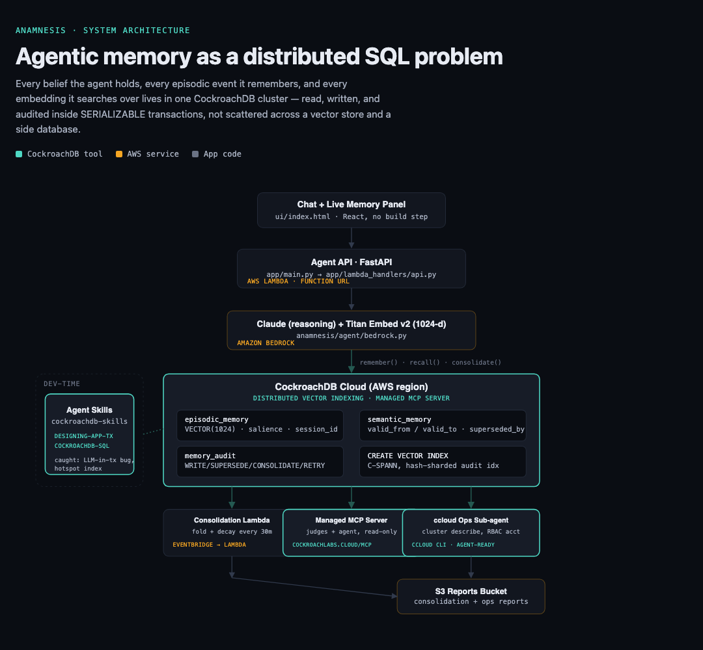

# 🪳 Anamnesis — Agentic Memory as a Distributed SQL Problem

**Built for the [CockroachDB × AWS Hackathon](https://cockroachdb-ai.devpost.com) — Build with Agentic Memory.**

> Everyone bolts a vector store onto an agent and calls it memory. Real memory is
> *transactional, temporal, and self-correcting* — which makes it a database
> problem, not an embeddings problem. Anamnesis puts an agent's beliefs, their
> history, and their embeddings in one consistent, distributed SQL system:
> CockroachDB.

Anamnesis is a memory layer for AI agents with:
- **Episodic + semantic memory** — raw events and consolidated beliefs, not just a flat vector store.
- **Time-travel** — beliefs carry `valid_from`/`valid_to` validity intervals, so the agent can answer "what did you believe last week?", not just "what do you believe now?"
- **Contradiction detection & self-correction** — new beliefs are checked against existing ones (vector similarity + LLM judgment); contradictions supersede the old belief instead of silently overwriting it, with a full `superseded_by` chain.
- **Consolidation & forgetting** — an LLM-driven job folds low-salience episodic chatter into durable semantic beliefs and decays what's no longer relevant.
- **Full auditability** — every memory write, supersede, consolidation, decay, and transaction retry is logged to an immutable `memory_audit` table, in the same transaction as the change it records.
- **Survivability** — memory writes are wrapped in CockroachDB SERIALIZABLE transactions with automatic client-side retry on both contention (SQLSTATE `40001`) and lost/killed connections mid-write (`connection_invalidated`); the whole unit of work — reads and writes — is redone from scratch on retry via `run_in_transaction()`, so a write either fully lands (episode + belief + audit together) or doesn't happen at all. Covered by a test that injects a simulated dropped connection and asserts the write survives.

## Why this is a database problem, not a vector-store problem

A vector store can tell you "these 5 memories are similar to this query."
It cannot tell you:
- which of those memories is still true,
- when it stopped being true and what replaced it,
- what the agent believed as of a specific point in time,
- or guarantee that a belief update and its audit trail land together, even under a mid-write failure.

Those require transactions, validity intervals, and a single consistent
source of truth — CockroachDB, not a bolted-on ANN index.

## Architecture



```
React/HTML UI (chat + live memory panel)
        │
FastAPI Agent API — AWS Lambda (Function URL)
        │
Amazon Bedrock: Claude (reasoning) + Titan Text Embeddings v2 (1024-dim)
        │
┌───────────────────────────────────────────────────────────┐
│                 CockroachDB (Cloud, AWS region)             │
│  episodic_memory   raw events, VECTOR(1024), salience       │
│  semantic_memory   beliefs, valid_from/valid_to,             │
│                     superseded_by, source_episodes           │
│  memory_audit       every WRITE/CONSOLIDATE/DECAY/SUPERSEDE  │
│                     /RETRY, same transaction as the change   │
│  + CREATE VECTOR INDEX (C-SPANN, distributed ANN) on both    │
│    embedding columns                                         │
└───────────────────────────────────────────────────────────┘
        ▲                    ▲                       ▲
Consolidation Lambda    Managed MCP Server      ccloud CLI ops
(EventBridge, 30 min)   (read-only; judges &    sub-agent (RBAC
                         the agent itself can    service account;
                         introspect memory)      writes findings back
                                                  into its own memory)
S3: consolidation reports + conversation exports
```

## CockroachDB tools used (all 4)

| Tool | How it's used |
|---|---|
| **Distributed Vector Indexing** | `CREATE VECTOR INDEX` on `episodic_memory.embedding` and `semantic_memory.embedding` (1024-dim, Titan v2). All recall (`anamnesis/memory.py: recall`, `detect_and_resolve_contradiction`) is ANN search filtered by `valid_to IS NULL` for current beliefs. |
| **Managed MCP Server** | Wired for read-only memory introspection — judges (or the agent itself) can query `semantic_memory`/`memory_audit` directly via any MCP client. See [`infra/README.md`](infra/README.md#cockroachdb-managed-mcp-server--judges-guide). |
| **ccloud CLI (agent-ready)** | `app/lambda_handlers/ops_agent.py` — a scheduled sub-agent that runs `ccloud cluster describe` / `ccloud backup list` (JSON output) against the cluster hosting its own memory, summarizes cluster health with the LLM, and writes the observation into its own memory (`ops_log` + a semantic self-observation). Uses a read-only RBAC service account, never the org admin key. |
| **Agent Skills Repo** | Installed the real, open-source [`cockroachlabs/cockroachdb-skills`](https://github.com/cockroachlabs/cockroachdb-skills) and concretely applied two of them during development — `designing-application-transactions` caught a real bug (an LLM call living inside a retryable transaction) and `cockroachdb-sql` flagged a hotspot-risk index that got hash-sharded. See [`.claude-skills/README.md`](.claude-skills/README.md) for exactly what was found and fixed, plus tool feedback for Cockroach Labs. |

## AWS services used

- **Amazon Bedrock** — Claude for reasoning/contradiction-judgment/consolidation summarization; Titan Text Embeddings v2 for all embeddings.
- **AWS Lambda** — chat API (Function URL), scheduled consolidation job, scheduled ops sub-agent.
- **Amazon EventBridge** — schedules the consolidation (every 30 min) and ops-agent (hourly) Lambdas.
- **Amazon S3** — consolidation reports and conversation exports.

## The 6 demo moments

1. **Persistence with provenance** — talk to the agent, restart everything, come back later — it remembers, citing when it learned each fact.
2. **Contradiction** — "I'm vegetarian" → later "grab me chicken tikka" → the agent notices, asks, and supersedes the old belief. Watch the `superseded_by` chain appear live in the memory panel / via MCP.
3. **Time-travel** — "what did you believe about my diet last week?" returns the old belief via its validity interval, not the current one.
4. **Forgetting** — trigger consolidation live: low-salience episodic chatter folds into one semantic belief with provenance, audited.
5. **Survivability** — kill the connection mid-write (or watch the automated test that simulates it); the whole transaction is retried from scratch and nothing is lost — visible as a `RETRY` row in the audit stream.
6. **Self-awareness** — ask the agent about the health of its own memory substrate; it answers using a ccloud CLI cluster inspection and remembers the answer.

## Quickstart (local, no cloud account required)

```bash
python3 -m venv .venv && source .venv/bin/activate
pip install -e ".[dev]"

make dev-db      # local CockroachDB v25.2 in Docker, vector indexing enabled
make migrate      # apply schema
make test         # full pytest suite, runs against the local cluster

export ANAMNESIS_MOCK_LLM=1   # no AWS credentials needed for local dev
make run          # FastAPI on :8000
make ui           # static UI on :5173, then open http://localhost:5173?api=http://localhost:8000
```

## Deploying for real (CockroachDB Cloud + AWS Bedrock/Lambda/S3)

See [`infra/README.md`](infra/README.md) for cluster setup, Bedrock model access, `sam deploy`, the ccloud RBAC service account, and the MCP judge's guide.

## Repository layout

```
anamnesis/          pip-installable memory library (remember/recall/beliefs_asof/consolidate)
  db/                SQLAlchemy models, CockroachDB engine + retry handling, schema.sql
  agent/             Bedrock client wrapper, demo agent loop
app/                 FastAPI app + AWS Lambda handlers (chat API, consolidation, ops agent)
migrations/          Alembic migrations
infra/               AWS SAM template + deployment/RBAC/MCP docs
ui/                  Chat + live memory panel (static, no build step)
tests/               pytest suite (runs against a real local CockroachDB via Docker)
.claude-skills/      Agent Skills Repo usage notes + tool feedback
```

## Failure modes & honest limitations (documented, not hidden)

- **Single demo user, no auth.** Multi-tenancy is straightforward to add (scope every query by `tenant_id`) but out of scope for the hackathon window.
- **Contradiction detection is heuristic** — ANN similarity + one LLM call. It will occasionally miss a contradiction phrased very differently from the original belief, or (rarely) flag a false positive; both are visible and correctable in the audit trail rather than silent.
- **`ccloud` ops agent requires a container-image Lambda for AWS deployment** (the `ccloud` binary isn't pip-installable); documented in `infra/README.md` rather than shipped as a hidden gap.
- **Salience decay/consolidation thresholds are simple constants**, not tuned on real usage data — flagged as a parameter to tune with production traffic, not a hardcoded assumption we're hiding.
- **No production secrets management wired up** for the local Quickstart (`.env` file) — `infra/template.yaml` uses CloudFormation parameters with `NoEcho`; a real deployment should move `DATABASE_URL`/API keys to AWS Secrets Manager.
- **CORS is wide open** (`allow_origins=["*"]`) so the demo UI can be hosted anywhere without a build step; a real deployment should pin this to the actual UI origin.

## License

MIT — see [LICENSE](LICENSE).
